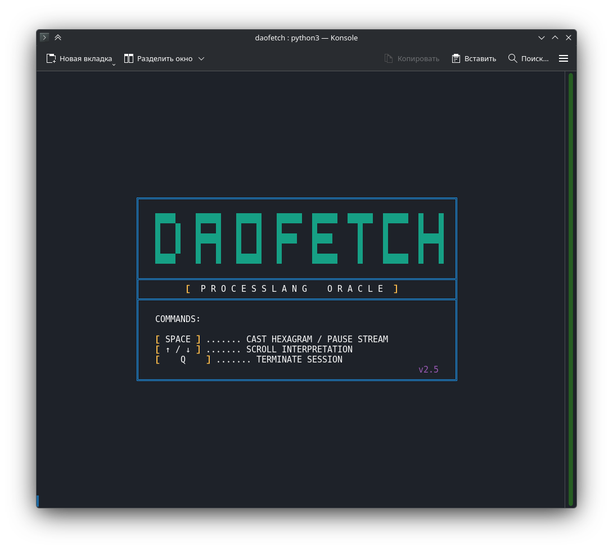
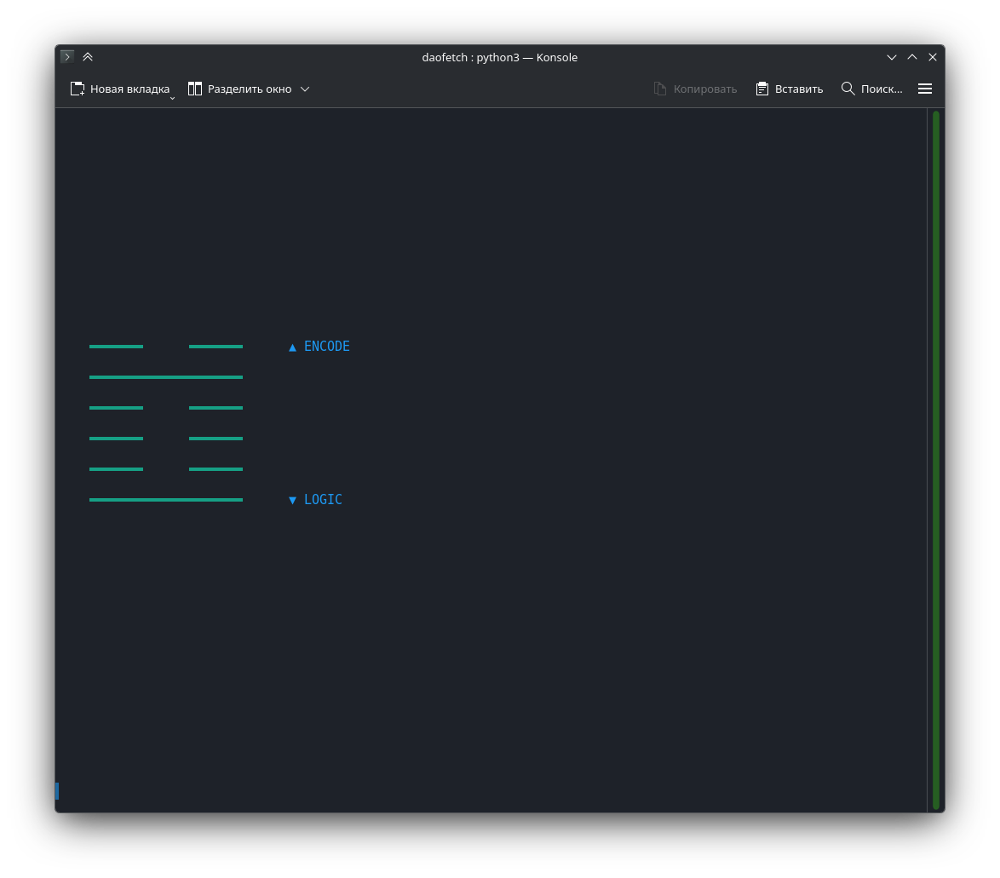
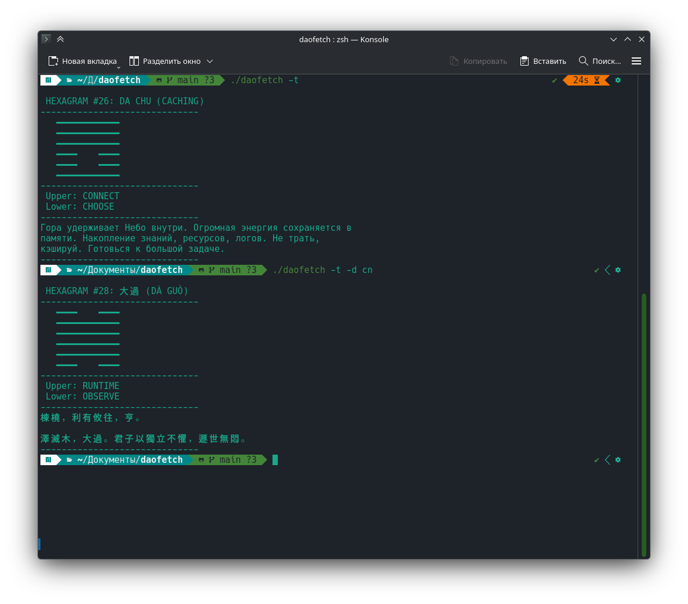

# DAOFETCH ☷

> **CLI-Оракул для Кибер-Даосов.** Гадание на тактовой частоте процессора.

[🇺🇸 English](README_EN.md) | [🇨🇳 中文](README_CN.md)

<p align="center">
  
  
</p>
<p align="center">
  
  
</p>

**daofetch** — это терминальный оракул И Цзин, использующий системную энтропию (`/dev/urandom`) и тайминги процессора для эмуляции броска монет. Программа рассматривает древнюю систему не как суеверие, а как бинарный код реальности.

Основанный на философии **ProcessLang**, daofetch реализует механику "Квантового Коллапса": гексаграммы сменяют друг друга тысячи раз в секунду, пока наблюдатель (вы) не подаст сигнал прерывания.

## ⚡ Особенности

* **Истинная Энтропия:** Использует SHA-256 хэширование системного шума и наносекундных меток времени.
* **Max CPU Flux:** Состояния меняются быстрее, чем способен уловить человеческий глаз (работает на скорости процессора).
* **Эффект Наблюдателя:** Нажмите `SPACE`, чтобы сколлапсировать волновую функцию и зафиксировать результат.
* **Режимы TUI и CLI:** Красивый интерактивный интерфейс на `curses` или чистый текстовый вывод для пайплайнов.
* **Система Колод (Decks):** Поддержка сменных JSON-"прошивок". Переключайтесь между ProcessLang, Классическим И Цзин или Киберпанк-трактовками прямо в меню.
* **Smart Wrap:** Кастомный движок переноса строк, корректно работающий с широкими символами (Кириллица/CJK).

## 📥 Установка

### Вручную (Linux / macOS)

1.  **Клонируйте репозиторий:**
    ```bash
    git clone [https://github.com/slasten3826/daofetch.git](https://github.com/slasten3826/daofetch.git)
    cd daofetch
    ```

2.  **Сделайте файл исполняемым:**
    ```bash
    chmod +x daofetch
    ```

3.  **Запуск:**
    ```bash
    ./daofetch
    ```

*(Опционально)* Создайте симлинк, чтобы запускать команду из любой папки:
```bash
sudo ln -s $(pwd)/daofetch /usr/local/bin/daofetch

```

### Arch Linux / Manjaro

Пакет `daofetch-git` скоро появится в AUR.

## 🕹 Использование

### TUI Режим (По умолчанию)

Запустите без аргументов для входа в интерактивный интерфейс.

* **`SPACE`**: Стоп/Старт потока (Коллапс Гексаграммы).
* **`СТРЕЛКИ / PGUP / PGDN`**: Прокрутка текста толкования.
* **`Q`**: Выход.

### CLI Режим (Только текст)

Полезно для скриптов, пайпов или минимализма. Выводит результат сразу в stdout.

```bash
./daofetch --text

```

### Аргументы командной строки

| Флаг | Описание |
| --- | --- |
| `-t`, `--text` | Запуск в текстовом (CLI) режиме без интерфейса. |
| `-o`, `--options` | Открыть меню настроек (TUI) для выбора колоды по умолчанию. |
| `-d`, `--deck [NAME]` | Временный запуск с конкретной колодой (например, `-d cn` для китайской). |
| `-h`, `--help` | Показать справку. |

## 🎴 Колоды и Конфигурация

Daofetch поддерживает кастомные "Колоды" (JSON файлы с определениями гексаграмм).

**Структура файлов:**
Программа ищет колоды в `~/.config/daofetch/` и в локальной папке `decks/`.

**Создание своей колоды:**

1. Создайте JSON файл с именем вида `data_mydeck.json`.
2. Поместите его в `~/.config/daofetch/`.
3. Используйте структуру из `decks/data.json`.

## 🧬 Философия

> "Дао, которое может быть закожено, не есть вечное Дао. Но код, который исполняется — реален."

Daofetch работает на принципе: **Случайность — это ресурс**. Подключаясь к тепловому шуму железа и джиттеру таймингов, мы получаем доступ к хаотическому слою физической реальности. Ввод пользователя служит сигналом синхронизации, мостом между кремниевым хаосом и человеческим намерением.

## 📜 Лицензия

MIT License. Hack the planet.

```

---

### 2. Английский `README_EN.md`
Создай этот файл в той же папке.

```markdown
# DAOFETCH ☷

> **The CLI Oracle for Cyber-Taoists.** Divination at CPU clock speed.

[🇷🇺 Русский](README.md) | [🇨🇳 中文](README_CN.md)

<p align="center">
  
  
</p>

**daofetch** is an I Ching terminal oracle that uses system entropy (`/dev/urandom`) and CPU timings to emulate coin tossing. The program treats the ancient system not as superstition, but as the binary code of reality.

Based on the **ProcessLang** philosophy, daofetch implements "Quantum Collapse" mechanics: hexagrams cycle thousands of times per second until the observer (you) sends an interrupt signal.

## ⚡ Features

* **True Entropy:** Uses SHA-256 hashing of system noise and nanosecond timestamps.
* **Max CPU Flux:** States change faster than the human eye can perceive.
* **Observer Effect:** Press `SPACE` to collapse the wavefunction and fix the result.
* **TUI & CLI Modes:** Beautiful `curses` interface or clean text output for pipelines.
* **Deck System:** Support for swappable JSON "firmwares". Switch between ProcessLang, Classical I Ching, or Cyberpunk interpretations.
* **Smart Wrap:** Custom word-wrapping engine supporting wide characters (CJK/Cyrillic).

## 📥 Installation

### Manual (Linux / macOS)

```bash
git clone [https://github.com/slasten3826/daofetch.git](https://github.com/slasten3826/daofetch.git)
cd daofetch
chmod +x daofetch
./daofetch

```

### Arch Linux / Manjaro

The `daofetch-git` package is coming soon to AUR.

## 🕹 Usage

* **`SPACE`**: Stop/Start flux (Collapse Hexagram).
* **`ARROWS`**: Scroll interpretation.
* **`Q`**: Quit.

**CLI Mode (Text only):**

```bash
./daofetch --text

```

## 🧬 Philosophy

> "The Dao that can be coded is not the eternal Dao. But the code that executes is real."

Daofetch operates on the principle: **Randomness is a resource**. By tapping into hardware thermal noise and timing jitter, we access the chaotic layer of physical reality. User input serves as a synchronization signal, a bridge between silicon chaos and human intent.

## 📜 License

MIT License. Hack the planet.

```

---

### 3. Китайский `README_CN.md`
Создай этот файл. Это добавит +100 к карме проекта.

```markdown
# DAOFETCH (道 Fetch) ☷

> **赛博道士的命令行神谕。** 以 CPU 时钟速度进行占卜。

[🇷🇺 Русский](README.md) | [🇺🇸 English](README_EN.md)

<p align="center">
  
  
</p>

**daofetch** 是一个终端易经（I Ching）工具，利用系统熵（`/dev/urandom`）和 CPU 计时来模拟掷币。该程序不将古老的系统视为迷信，而是将其视为现实的二进制代码。

基于 **ProcessLang** 哲学，daofetch 实现了“量子坍缩”机制：卦象每秒变化数千次，直到观察者（您）发出中断信号。

## ⚡ 特性

* **真实熵 (True Entropy):** 使用 SHA-256 对系统噪声和纳秒时间戳进行哈希处理。
* **CPU 极速流:** 状态变化速度超过人眼捕捉极限。
* **观察者效应:** 按下 `SPACE` 键以坍缩波函数并锁定结果。
* **TUI 和 CLI 模式:** 美观的 `curses` 界面或用于管道的纯文本输出。
* **卡组系统 (Decks):** 支持可替换的 JSON“固件”。在 ProcessLang、经典易经或赛博朋克解读之间切换。
* **智能换行:** 自定义换行引擎，完美支持宽字符（中文/西里尔字母）。

## 📥 安装

### 手动安装 (Linux / macOS)

```bash
git clone [https://github.com/slasten3826/daofetch.git](https://github.com/slasten3826/daofetch.git)
cd daofetch
chmod +x daofetch
./daofetch

```

### Arch Linux / Manjaro

`daofetch-git` 软件包即将登陆 AUR。

## 🕹 使用方法

* **`SPACE` (空格)**: 停止/开始 (卦象坍缩).
* **`方向键`**: 滚动解卦文本.
* **`Q`**: 退出.

**CLI 模式 (纯文本):**

```bash
./daofetch --text

```

## 🧬 哲学

> “道可道，非常道。但运行之码，即为真实。”

Daofetch 的运作原则是：**随机性是一种资源**。通过接入硬件热噪声和计时抖动，我们得以接触物理现实的混沌层。用户输入作为同步信号，架起了硅基混沌与人类意图之间的桥梁。

## 📜 许可证

MIT License. Hack the planet.

